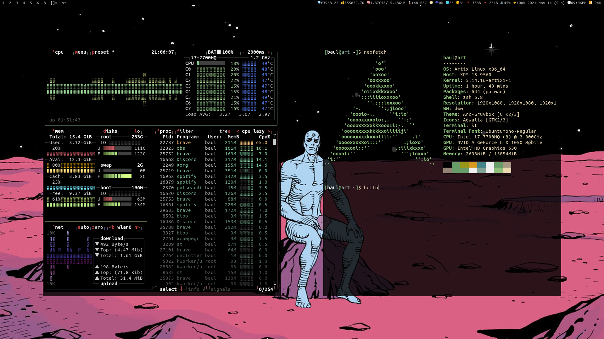

# paul's dotfiles


all configuration files for my minimal terminal-and-vim-based Artix Linux environment

```txt
paul@art
----------------- 
OS: Artix Linux (OpenRC)
Host: XPS 15 9560
Kernel: 5.14.12
Shell: zsh 5.8
WM: dwm 6.2
Terminal: st 0.8.4
```

- Very useful scripts are in `~/.local/bin/`
- Settings for:
	- vim/nvim (text editor)
	- zsh (shell)
	- lf (file manager)
	- zathura (pdf viewer)
	- mpd/ncmpcpp (music)
	- sxiv (image/gif viewer)
	- mpv (video player)
- I try to minimize what's directly in `~` so:
	- All configs that can be in `~/.config/` are.

## Usage

These dotfiles are intended to go with numerous suckless programs I use:

- [dwm](https://github.com/paulphys/dwm) (window manager)
- [dwmblocks](https://github.com/paulphys/dwmblocks) (statusbar)
- [dmenu](https://github.com/paulphys/dmenu) (dynamic menu)
- [st](https://github.com/paulphys/st) (terminal emulator)

